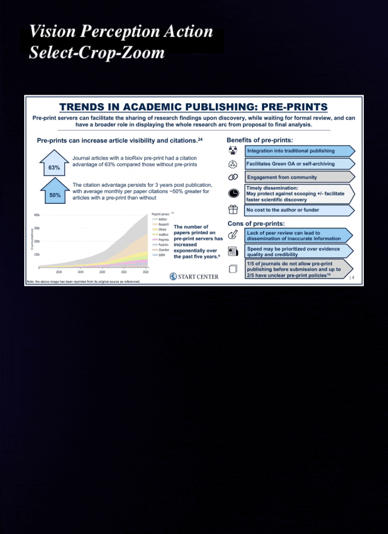
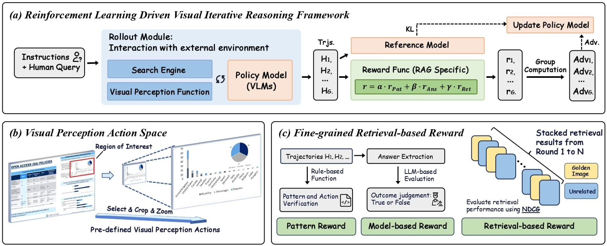

## VRAG-RL: Empower Vision-Perception-Based RAG for Visually Rich Information Understanding via Iterative Reasoning with Reinforcement Learning


<div align="center">
<p><strong>A Multi-Turn Multi-Modal Agent Training Framework</strong></p>
<a href="https://arxiv.org/pdf/2505.22019" target="_blank"></a>
<a href="https://huggingface.co/Qiuchen-Wang/Qwen2.5-VL-7B-VRAG" target="_blank"></a>
</div>

<div align="center" style="background-color: #f0f0f0; padding: 5px; border-radius: 5px;">
  <table style="border-collapse: collapse; margin: 0 auto;">
    <tr>
      <td style="padding: 5px;">
        
      </td>
      <td style="padding: 5px;">
        
      </td>
      <td style="padding: 5px;">
        
      </td>
    </tr>
  </table>
</div>

<https://github.com/user-attachments/assets/6d9bd7af-4ad9-4804-910b-2b2c5b2e0c35>

<https://github.com/user-attachments/assets/22c90e3e-ec04-4967-9bb9-52d8c1ebd410>


## 🔥 News
- 🎉 We have released the demo, allowing you to customize your own VRAG.
- 🎉 Our framework integrates SOTA visual embedding models, enabling you to create your own retriever.
- 🎉 We are releasing our 7B model and will gradually release models in more sizes. Welcome to use!

## 🚀 Overview
- We introduce **VRAG**, a purely visual RAG agent that enables VLMs to progressively gather information from a coarse-grained to a fine-grained perspective.
- We propose **VRAG-RL**, a novel reinforcement learning framework tailored for training VLMs to effectively reason, retrieve, and understand visually rich information.
- We have released the **training framework** of VRAG-RL, a novel multi-turn and multimodal training framework with strong extensibility, capable of supporting training with various tools.

<div align="center">
<p align="center">
  
</p>
</div>


## 🔍 Quick Start

**Please refer to `run_demo.sh` to quickly start the demo.** Below is a step-by-step guide to help you run the demo on our example data:

### Dependencies
```bash
# Create environment
conda create -n vrag python=3.10
# Clone project
git clone https://github.com/alibaba-nlp/VRAG.git
cd VRAG
# Install requirements for demo only
pip install -r requirements_demo.txt
```

### Run VRAG Demo

First, you need to launch the search engine, which utilizes the Colpali embedding model family. It is preferable to deploy the search engine independently on a single GPU.
```bash
## Deploy search engine server
python search_engine/search_engine_api.py
```
Then download the model and deploy the server using vllm. For a 7B model, it can be deployed on a single A100 80G GPU.
```bash
vllm serve autumncc/Qwen2.5-VL-7B-VRAG --port 8001 --host 0.0.0.0 --limit-mm-per-prompt image=10 --served-model-name Qwen/Qwen2.5-VL-7B-Instruct
```
Finally, use Streamlit to launch the demo.
```bash
streamlit run demo/app.py
```

## 💻 Build Your Own VRAG
Below is a step-by-step guide to help you run the VRAG on your own corpus, the entire process is divided into three steps: 
- The 1st and 2nd step are aimed at building your own purely vision-based search engine, 
- The 3rd step, similar to the quick start, is to launch the demo.

You should first convert your document to `.jpg` and store it in the `search_engine/corpus/img` with script `search_engine/corpus/pdf2images.py`. 

### Step1. Build the Index Database
Our framework is built on the foundation of the Llama-Index. We preprocess the corpus in advance and then establish an index database. 

Before embedding the whole dataset, you can run `./search_engine/vl_embedding.py` to check whether the embedding model is loaded correctly:
```python
# Test embedding model
python ./search_engine/vl_embedding.py
```
Then, you can run `ingestion.py` to embedding the whole dataset:
```python
# Document ingestion and Multi-Modal Embedding
python ./search_engine/ingestion.py
```

### Step2. Run Multi-Modal Retriever
Try using the search engine in `./search_engine/search_engine.py`:
```python
# initial engine
search_engine = SearchEngine(dataset_dir='search_engine/corpus', node_dir_prefix='colqwen_ingestion',embed_model_name='vidore/colqwen2-v1.0')
# Retrieve some results
recall_results = search_engine.batch_search(['some query A', 'some query B'])
```
Once the corpus and models for the search engine is prepared, you can directly run the search engine API server:
```bash
# run search engine server with fastapi
python search_engine/search_engine_api.py
```

### Step3. Run VRAG
Just like in the quick start guide, you can run the demo after deploying the VLM service:
```bash
vllm serve Qwen/Qwen2.5-VL-7B-Instruct --port 8001 --host 0.0.0.0 --limit-mm-per-prompt image=10 --served-model-name Qwen/Qwen2.5-VL-7B-Instruct
```
Use Streamlit to launch the demo.
```bash
streamlit run demo/app.py
```
Optionly, You can directly use our script for generation in `demo/vrag_agent.py` or you can integrate it into your own framework:
```python
from vrag_agent import VRAG
vrag = VRAG(base_url='http://0.0.0.0:8001/v1', search_url='http://0.0.0.0:8002/search', generator=False)
answer = vrag.run('What is the capital of France?')
```


## ⚙️ Train Model with VRAG-RL

<div align="center">
<p align="center">
  
</p>
</div>

### Training Dependencies
```bash
cd VRAG
# Install requirements for training
pip install -r requirements_train.txt
# Install training dependencies
pip install -e .
```

### Step1. Prepare Data.

#### Benchmark & Training Data
Please download the original document repositories and queries for each benchmark separately from [SlideVQA](https://huggingface.co/datasets/NTT-hil-insight/SlideVQA), [ViDoSeek](https://huggingface.co/datasets/autumncc/ViDoSeek) and [MMLongBench-Doc](https://huggingface.co/datasets/yubo2333/MMLongBench-Doc). For training, we mixed part of the [SlideVQA](https://huggingface.co/datasets/NTT-hil-insight/SlideVQA) training set to create the training data. The SlideVQA-train can be used as an example to construct SFT data and RL data. During evaluation, we suggest merge all benchmark corpora into a single corpus to create a more challenging setting that simulates real-world scenarios.

#### Example Data & Dataset Convertion
Organize all data into the following format, a reference example will be provided in ```examples``` directory.
```json
{
    "uid": "04d8bb0db929110f204723c56e5386c1d8d21587_2",
    "query": "What is the temperature of Steam explosion of Pretreatment for Switchgrass and Sugarcane bagasse preparation?", 
    "reference_answer": "195-205 Centigrade", 
    "meta_info": {
        "file_name": "Pretreatment_of_Switchgrass.pdf", 
        "reference_page": [10, 11], 
        "source_type": "Text", 
        "query_type": "Multi-Hop" 
    }
}
```

Use the script `./scripts/hf_dataset_convert.py` to convert the unified format to Parquet.
```bash
python ./scripts/hf_dataset_convert.py
```

### Step2. Build Training Corpus & Run Multi-Modal Search Engine.

Follow the above section to construct your own corpus and start the search engine.

### Step3. Construct High-quality CoT & Learn Patterns via SFT.

To construct high-quality data using scripts `./scripts/data_construct_pipeline.py`, you are welcome to use DashScope based on Alibaba Cloud. You need to set the environment variable `DASH_SCOPE_KEY`:
```bash
export DASH_SCOPE_KEY=xxx
```
Please note that for expert models, we recommend using models with consistent coordinate systems. If different models are used, it is necessary to map the coordinates to the same coordinate system.
```python
def convert_to_qwen25vl_format(bbox, orig_height, orig_width, factor=28, min_pixels=56*56, max_pixels=14*14*4*1280):
    new_height, new_width = smart_resize(orig_height, orig_width, factor, min_pixels, max_pixels)
    scale_w = new_width / orig_width
    scale_h = new_height / orig_height
    
    x1, y1, x2, y2 = bbox
    x1_new = round(x1 * scale_w)
    y1_new = round(y1 * scale_h)
    x2_new = round(x2 * scale_w)
    y2_new = round(y2 * scale_h)
    
    x1_new = max(0, min(x1_new, new_width - 1))
    y1_new = max(0, min(y1_new, new_height - 1))
    x2_new = max(0, min(x2_new, new_width - 1))
    y2_new = max(0, min(y2_new, new_height - 1))
    
    return [x1_new, y1_new, x2_new, y2_new]
```

Here, you can use a script `./scripts/cot_convert_sft.py` to convert the sampled data into the llama factory format and then proceed with training using the [llama factory](https://github.com/hiyouga/LLaMA-Factory). When fine-tuning the Qwen2.5VL model, please pay special attention to the maximum and minimum values of the coordinates. You need to normalize the coordinates and images to the same scale, This is also the key to the crop&zoom action: 

$$\hat{\mathcal{R}} = Crop(\mathbf{I}_{raw}, [x_{min} \times \frac{w_{raw}}{w_{encoder}}, y_{min} \times \frac{h_{raw}}{h_{encoder}}, x_{max} \times \frac{w_{raw}}{w_{encoder}}, y_{max} \times \frac{h_{raw}}{h_{encoder}}]).$$

You can find relevant reference code in the [https://github.com/QwenLM/Qwen3-VL/blob/main/qwen-vl-finetune/tools/process_bbox.ipynb](https://github.com/QwenLM/Qwen3-VL/blob/main/qwen-vl-finetune/tools/process_bbox.ipynb), and our code also includes these functions, which you can use directly.

### Step4. Run RL Training with Qwen2.5-VL-Instruct.

#### Reward Function

You can customize your own training reward function in the ```./verl/workers/reward_manager/rm.py```. In this project, we simply modify the reward manager to implement a model-based reward. You can choose to deploy your own model with [vLLM](https://docs.vllm.ai/en/stable/configuration/serve_args.html) or use an [API](https://bailian.console.aliyun.com/#/home). 
```bash
# works num for reward model, depends on your qps
reward_model.rm_workers_num=10 \
# reward model url, if you deploy your own model, you can use your own model here
reward_model.rm_url="https://dashscope.aliyuncs.com/compatible-mode/v1/chat/completions" \
# reward model key, if you deploy model with vLLM, you can use "EMPTY"
reward_model.rm_key=$DASHSCOPE_API_KEY \
# reward model name
reward_model.rm_model_name="qwen-max-latest" \
```

#### Rollout Module

You can customize your own rollout module in the ```./vrag_agent/generation.py```. The Main Function is ```run_llm_loop```, which contains Generation -> Parse Action -> Observation -> Check Termination :

- Generation ```generate_with_gpu_padding``` pads the training batch and performs generation.
- Parse Action ```execute_predictions``` interprets the model's output and call API based on various actions to obtain the raw observation.
- Observation ```process_next_obs``` inserts the retrieved or cropped images into the context after processing.
- In the final step, check if there are any trajectories with unfinished interactions. For those trajectories that have not retrieved images, add image padding to facilitate batch generation by the vLLM engine.

#### Start Training
```bash
# start script
./train_grpo_qwen2_5_vl_7b.sh
```

## 🙏 Acknowledge
This work is implemented based on [ViDoRAG](https://github.com/Alibaba-NLP/ViDoRAG), [LLaMA-Factory](https://github.com/hiyouga/LLaMA-Factory), [Search-R1](https://github.com/PeterGriffinJin/Search-R1), and [verl](https://github.com/volcengine/verl). We greatly appreciate their valuable contributions to the community.


## 📝 Citation

```bigquery
@misc{wang2025vragrlempowervisionperceptionbasedrag,
      title={VRAG-RL: Empower Vision-Perception-Based RAG for Visually Rich Information Understanding via Iterative Reasoning with Reinforcement Learning}, 
      author={Qiuchen Wang and Ruixue Ding and Yu Zeng and Zehui Chen and Lin Chen and Shihang Wang and Pengjun Xie and Fei Huang and Feng Zhao},
      year={2025},
      eprint={2505.22019},
      archivePrefix={arXiv},
      primaryClass={cs.CL},
      url={https://arxiv.org/abs/2505.22019}, 
}
```